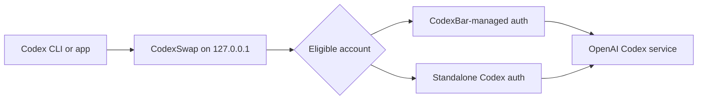

# CodexSwap

[](https://github.com/M1Vj/CodexSwap/actions/workflows/ci.yml)
[](https://www.apple.com/macos/)
[](https://www.swift.org/)
[](LICENSE)

CodexSwap is a local macOS menu-bar app for switching and rotating multiple Codex accounts without restarting an active Codex session. It owns the routing layer, integrates with CodexBar-managed accounts, tracks quota windows, and can move to the next eligible account when one reaches a usage limit.

> [!IMPORTANT]
> CodexSwap handles local Codex authentication tokens. It listens only on `127.0.0.1`, has no analytics or CodexSwap cloud service, and should only be installed from this repository's notarized releases. See [Security](SECURITY.md) and [Privacy](PRIVACY.md).

## Highlights

- Native Settings window and focused menu-bar controls—no terminal required for normal use.
- Reversible **Route Codex through CodexSwap** setting with backups of displaced Codex configuration.
- Independent **Launch at Login** setting, automatically suggested when routing is enabled.
- CodexBar-first account onboarding, plus a standalone `codex login` fallback.
- Priority or round-robin rotation and automatic switching after usage-limit responses.
- Usage refresh, notifications, and optional automatic or manual quota warm-up.
- Kanban task board that queues prompts and runs them automatically as sandboxed background `codex exec` sessions whenever quota returns, with plan-first documents for cross-window resumption and portable prompt export.
- Optional `codexswap` terminal shim for users who specifically want a wrapper command.

## Install

### Homebrew

After the first signed and notarized release is published:

```bash
brew tap M1Vj/CodexSwap https://github.com/M1Vj/CodexSwap
brew install --cask codexswap
```

The cask is generated from the notarized archive's exact SHA-256 checksum. Until that first release exists, Homebrew installation intentionally remains unavailable rather than distributing an ad-hoc-signed app.

### GitHub release

Download `CodexSwap-vX.Y.Z-macOS-universal.zip` from [Releases](https://github.com/M1Vj/CodexSwap/releases), open the archive, and move `CodexSwap.app` to `/Applications`. Public artifacts support both Apple silicon and Intel Macs and are accepted only after Developer ID signing, Apple notarization, ticket stapling, checksum validation, and Gatekeeper assessment.

### Build from source

Source builds are for development and are ad-hoc signed locally:

```bash
git clone https://github.com/M1Vj/CodexSwap.git
cd CodexSwap
swift test
Scripts/build-universal.sh
open dist/CodexSwap.app
```

Requires macOS 14 or newer and Xcode Command Line Tools with a Swift 6-compatible toolchain.

## First run

1. Open CodexSwap from `/Applications`; it appears in the menu bar rather than the Dock.
2. Choose **Settings…** (`⌘,`).
3. In **Accounts**, choose **Add in CodexBar…**. CodexSwap watches CodexBar's managed roster and imports the account automatically.
4. If CodexBar is unavailable, choose **Add Standalone…**, complete `codex login`, then choose **Rescan Accounts**.
5. In **General**, enable **Route Codex through CodexSwap**.
6. Restart existing Codex CLI or desktop sessions once so they load the new provider configuration.

Routing safely manages only CodexSwap's provider values in `~/.codex/config.toml`. The original content is recorded under `~/Library/Application Support/CodexSwap/` and restored when routing is disabled. If the managed block changes externally, Settings offers **Repair Routing…** instead of overwriting it silently.

## Settings

| Pane | Controls |
| --- | --- |
| **General** | Codex routing, Launch at Login, priority or round-robin rotation |
| **Accounts** | Account ownership, quota state, priority, switching, adding, removal, rescanning |
| **Automation** | Automatic quota warm-up, manual warm-up, task automation switches, rotation and limit notifications |
| **Advanced** | Proxy diagnostics and safe installation or removal of the optional terminal shim |

### Task board automation

**Task Board…** (`⌘T` from the menu) opens a kanban board with **To Do**, **In Queue**, **In Progress**, and **Done** columns. Each task holds its own settings: a prompt, the repository folder the Codex CLI opens in, a working branch, the model and reasoning effort, optional sandbox network access, and an optional per-task account list that overrides the board's global account checklist.

When automation is enabled, queued tasks start as background `codex exec` runs as soon as an enabled account has quota — including after a five-hour or weekly window reset. Runs execute with the workspace-write sandbox and never with approval bypass: writes stay confined to the task's repository (plus its `.git`) and the run's private `CODEX_HOME`. Every task plans first, maintaining `.codexswap/tasks/<slug>/PLAN.md` on its branch with a checklist, work log, and a final `STATUS:` line; a run interrupted by a usage limit waits in **In Progress** and resumes on the next window. **Export Prompt** copies a self-contained handoff (prompt, repository, branch, and current plan) for use in any other AI tool.

Task runs consume quota on the accounts you enable for automation. The **May consume banked window** switch controls whether automation may spend a reset that has not started yet.

### Quota warm-up

Usage polling does not start a quota window. Optional warm-up sends one small, real Codex request per eligible account when a new recorded five-hour cycle becomes available. **Warm all accounts now…** performs the same action manually after confirmation.

Warm-up consumes a small amount of quota. OpenAI does not publicly guarantee that one request starts every displayed five-hour or weekly window, so CodexSwap refreshes usage afterward and reports only reset data returned by the service. The automatic setting is off by default.

## How routing works

Codex normally keeps authentication in memory for the lifetime of a process. Replacing an auth file therefore cannot reliably switch an already-running session. CodexSwap instead configures Codex to use a local provider and replaces the authorization headers for each proxied request.



CodexBar remains the credential owner for CodexBar-managed accounts. CodexSwap reads its roster and fresher tokens but does not register accounts by modifying CodexBar's private data.

## Data and safety

- Local settings, imported rotation state, usage observations, and warm-up history live in `~/Library/Application Support/CodexSwap/`.
- Account records can contain access and refresh tokens and are restricted to the current user where macOS permits.
- Proxy traffic binds to IPv4 loopback only; CodexSwap does not expose a LAN listener.
- No account data, usage telemetry, or analytics are sent to the maintainer.
- Never attach `auth.json`, `accounts.json`, tokens, account IDs, or verbose request headers to an issue.

See [PRIVACY.md](PRIVACY.md) for the complete data model and [SECURITY.md](SECURITY.md) for private vulnerability reporting.

## Uninstall

Disable **Route Codex through CodexSwap** in Settings first so the previous Codex provider configuration is restored. Then:

```bash
brew uninstall --cask --zap codexswap
brew untap M1Vj/CodexSwap
```

For a manual installation, quit CodexSwap and move it from `/Applications` to Trash. Removing `~/Library/Application Support/CodexSwap/` deletes CodexSwap's imported state but does not delete `~/.codex`, CodexBar-managed homes, or revoke OpenAI sessions.

## Development

```bash
swift package resolve
swift test
swift build -c release
Scripts/build-app.sh
```

Repository layout:

- `Sources/SwapKit` — account store, routing, quota, refresh, warm-up, settings, and proxy engine.
- `Sources/swapd` — headless commands used for development and diagnostics.
- `Sources/CodexSwapApp` — native menu-bar application and Settings UI.
- `Scripts` — deterministic build, universal packaging, notarization, verification, and cask tooling.

Read [CONTRIBUTING.md](CONTRIBUTING.md), [Troubleshooting](docs/TROUBLESHOOTING.md), and [Release process](docs/RELEASING.md) before making changes. Releases follow [Semantic Versioning](https://semver.org/) and are tracked in [CHANGELOG.md](CHANGELOG.md).

## License

CodexSwap is available under the [MIT License](LICENSE).
