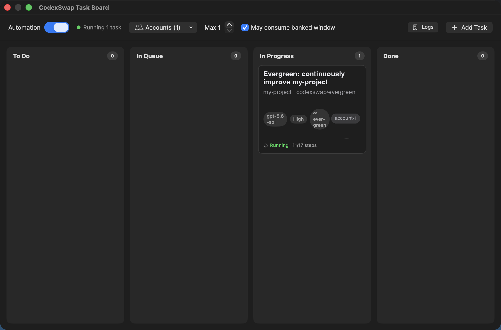
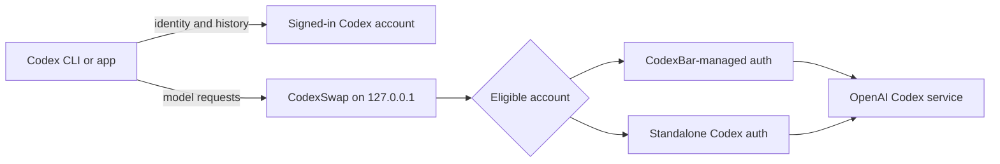

# CodexSwap

[](https://github.com/M1Vj/CodexSwap/actions/workflows/ci.yml)
[](https://www.apple.com/macos/)
[](https://www.swift.org/)
[](LICENSE)

CodexSwap is a local macOS menu-bar app for switching and rotating multiple Codex accounts without restarting an active Codex session. It owns the routing layer, integrates with CodexBar-managed accounts, tracks quota windows, and can move to the next eligible account when one reaches a usage limit.

> [!IMPORTANT]
> CodexSwap handles local Codex authentication tokens. It listens only on `127.0.0.1`, has no analytics or CodexSwap cloud service, and should only be installed from this repository's notarized releases. See [Security](SECURITY.md) and [Privacy](PRIVACY.md).

## Highlights

- Native Settings window and focused menu-bar controls—no terminal required for normal use.
- Reversible **Route Codex through CodexSwap** setting with backups of displaced Codex configuration.
- Independent **Launch at Login** setting that routing never changes.
- CodexBar-first account onboarding, plus a standalone `codex login` fallback.
- Priority or round-robin selection for new work, with active turns and runs pinned to their selected account.
- Usage refresh, notifications, quota warm-up, and opt-in automatic or confirmed manual reset-credit use.
- Kanban task board that queues prompts and runs them automatically as sandboxed background `codex exec` sessions whenever quota returns, with plan-first documents for cross-window resumption and portable prompt export.
- Optional `codexswap` terminal shim for users who specifically want a wrapper command.

## Install

### Homebrew

After the first signed and notarized release is published:

```bash
brew tap M1Vj/CodexSwap https://github.com/M1Vj/CodexSwap
brew install --cask codexswap
```

The cask is generated from the notarized archive's exact SHA-256 checksum. Until that first release exists, Homebrew installation intentionally remains unavailable rather than distributing an ad-hoc-signed app.

### GitHub release

Download `CodexSwap-vX.Y.Z-macOS-universal.zip` from [Releases](https://github.com/M1Vj/CodexSwap/releases), open the archive, and move `CodexSwap.app` to `/Applications`. Public artifacts support both Apple silicon and Intel Macs and are accepted only after Developer ID signing, Apple notarization, ticket stapling, checksum validation, and Gatekeeper assessment.

### Build from source

Source builds are for development and are ad-hoc signed locally:

```bash
git clone https://github.com/M1Vj/CodexSwap.git
cd CodexSwap
swift test
Scripts/build-universal.sh
open dist/CodexSwap.app
```

Requires macOS 14 or newer and Xcode Command Line Tools with a Swift 6-compatible toolchain.

## First run

1. Open CodexSwap from `/Applications`; it appears in the menu bar rather than the Dock.
2. Choose **Settings…** (`⌘,`).
3. In **Accounts**, choose **Add in CodexBar…**. CodexSwap watches CodexBar's managed roster and imports the account automatically.
4. If CodexBar is unavailable, choose **Add Standalone…**, complete `codex login`, then choose **Rescan Accounts**.
5. In **General**, enable **Route Codex through CodexSwap**.
6. Restart existing Codex CLI or desktop sessions once so they load the new provider configuration.

Routing safely keeps Codex's built-in `openai` provider identity and changes only the model `openai_base_url` in `~/.codex/config.toml`. Earlier CodexSwap routing selected a custom `codexswap` provider, which hid the signed-in account's old history; it did not delete that history. The repaired route does not replace Codex's ChatGPT identity backend, so login and chat history remain tied to the account signed in to Codex. The original provider content is recorded under `~/Library/Application Support/CodexSwap/` and restored when routing is disabled. If the managed block changes externally, Settings offers **Repair Routing…** instead of overwriting it silently.

**Launch CodexSwap at Login** is independent. Enabling or repairing routing never turns it on; enable it yourself only when you want the proxy ready immediately after signing in to the Mac.

## Settings

| Pane | Controls |
| --- | --- |
| **General** | Model routing and the independent Launch at Login setting |
| **Accounts** | Account identity, **Active** state, priority, reversible per-account routing pause, reset credits, confirmed **Use Reset…**, and automatic-reset protection; choose **Make Active** on another account |
| **Quota & Resets** | Quota warm-up, the global automatic-reset opt-in, interactive Codex exhaustion policy, and quota notifications |
| **Task Board** | Task automation, allowed accounts, concurrency, banked-window behavior, and its separate exhaustion policy |
| **Advanced** | Proxy diagnostics and safe installation or removal of the optional terminal shim |

### Task board automation



**Task Board…** (`⌘T` from the menu) opens a kanban board with **To Do**, **In Queue**, **In Progress**, and **Done** columns. Each task holds its own settings: a prompt, the repository folder the Codex CLI opens in, a working branch, the model with an optional fallback chain, reasoning effort, sandbox network access, and an optional per-task account list. Queued tasks reorder by drag with precise positioning, cards duplicate in one action, and finished work archives (with restore) instead of cluttering the board.

When automation is enabled, queued tasks start as background `codex exec` runs as soon as an enabled account has quota — including after a five-hour or weekly window reset. Priority or round-robin selection applies when a new run starts, then that Task Board run stays pinned to one account for the lifetime of its `codex exec` process. Usage polling and idle time never move it. Only a semantic upstream `usage_limit_reached` response may invoke the Task Board exhaustion policy described below. Transient failures retry with bounded backoff, a rejected model falls back down the task's model chain, and repeated no-progress sessions trigger one automatic plan repair before the task is surfaced for attention. Runs execute with the workspace-write sandbox and never with approval bypass: writes stay confined to the task's repository (plus its `.git`) and the run's private `CODEX_HOME`.

Every task plans first, maintaining `.codexswap/tasks/<slug>/PLAN.md` on its branch with a bounded Handoff section, a checklist, and a final `STATUS:` line, while chronological history lives in `WORKLOG.md`; a task retires to Done only when its run exits cleanly with every checklist item ticked. Evergreen tasks loop forever in bounded cycles, archiving each finished cycle to `CYCLES.md` before reseeding a fresh checklist. **Export Prompt** copies a self-contained handoff for any other AI tool.

Click any card to open the **inspector**: a live log tail with follow/pause, a per-run timeline with durations, outcomes, token usage, and the accounts that served each run, the parsed plan checklist, and a **Changes** tab listing the run's commits and diff totals with a warning when the agent worked on an unexpected branch. Waiting cards state the real reason — quota cooldown with a countdown, retry backoff, busy repository, or a full run slot — and failed cards offer visible **Retry Now** and **Requeue** actions. The menu-bar status item mirrors it all: running tasks with progress, the next reset countdown, and per-account usage, while notifications deep-link back to the affected task.

Task runs consume quota on the accounts you enable for automation. The **May consume banked window** switch controls whether automation may spend a reset that has not started yet. Every scheduling decision, launch, and exit is traced to `~/Library/Application Support/CodexSwap/automation.log`; run history is capped per task with older records archived as JSONL, and logs prune automatically for unattended 24/7 operation.

### Quota warm-up

Usage polling does not start a quota window. Optional warm-up sends one small, real Codex request per eligible account when a new recorded five-hour cycle becomes available. **Warm all accounts now…** performs the same action manually after confirmation.

Warm-up consumes a small amount of quota. OpenAI does not publicly guarantee that one request starts every displayed five-hour or weekly window, so CodexSwap refreshes usage afterward and reports only reset data returned by the service. The automatic setting is off by default.

### Pause routing for one account

In **Settings → Accounts**, choose **Disable Routing** to pause an account. The row shows **Routing Disabled** and offers **Enable Routing** until you resume it. The pause persists across app restarts. CodexSwap keeps the account record, OAuth credentials, and saved Task Board account choices intact.

A paused account is excluded from new interactive selection, the next request on an existing interactive or Task Board run pin, actual-429 failover, Task Board scheduling, manual and automatic warm-up, and automatic reset. If the account was serving a pinned turn or run, the pause is an administrative exception to sticky routing and takes effect on its next request. Quota percentages and quota displays still do not move a pin.

CodexSwap does not cancel a request that it already forwarded or a Task Board runner that already started. The next proxy selection rebinds the pin to an eligible account or fails when none is eligible. You can still choose **Use Reset…** for the paused account and confirm the manual reset. Automatic reset remains opt-in and never uses a paused account.

### Exhaustion and reset policies

CodexSwap does not switch accounts at a usage percentage or after an idle gap. An active interactive turn stays pinned to the account selected for its first model request, just as each Task Board run stays pinned for its process lifetime. OpenAI's Codex protocol documents continuation state for an active turn, but that is not a promise that continuation remains available after a turn is stopped or that a new turn receives the same treatment.

Interactive Codex and Task Board have independent exhaustion policies. Each offers **Reset Current First**, **Switch First**, and **Stop & Notify**. A policy runs only for a semantic upstream `usage_limit_reached` response and makes at most one decision with one retry; it does not loop through accounts or consume multiple reset credits for one rejected request.

Automatic reset-credit use is off by default. It requires the global opt-in, and **Protect from Automatic Reset** affects only automatic use. The manual **Use Reset…** action always asks for confirmation, including on a protected account. When several credits are available, CodexSwap chooses the earliest-expiring credit first. Reset-credit access uses an undocumented internal endpoint and may stop working or change without notice.

## How routing works

Codex normally keeps authentication in memory for the lifetime of a process. Replacing an auth file therefore cannot reliably switch an already-running session. CodexSwap keeps `model_provider = "openai"`, changes only `openai_base_url` to point model requests at the local proxy, and replaces authorization headers on those requests. Identity and history traffic continues to Codex's normal ChatGPT backend under the account signed in to Codex.



Builds that previously routed the whole ChatGPT backend or selected a separate `codexswap` provider are migrated automatically to this built-in-provider layout when CodexSwap starts. The optional terminal shim is upgraded the same way. Restart Codex once afterward to reload the corrected route.

CodexBar remains the credential owner for CodexBar-managed accounts. CodexSwap reads its roster and fresher tokens but does not register accounts by modifying CodexBar's private data.

## Data and safety

- Local settings, imported rotation state, usage observations, and warm-up history live in `~/Library/Application Support/CodexSwap/`.
- Account records can contain access and refresh tokens and are restricted to the current user where macOS permits.
- Proxy traffic binds to IPv4 loopback only; CodexSwap does not expose a LAN listener.
- No account data, usage telemetry, or analytics are sent to the maintainer.
- Never attach `auth.json`, `accounts.json`, tokens, account IDs, or verbose request headers to an issue.

See [PRIVACY.md](PRIVACY.md) for the complete data model and [SECURITY.md](SECURITY.md) for private vulnerability reporting.

## Uninstall

Disable **Route Codex through CodexSwap** in Settings first so the previous Codex provider configuration is restored. Then:

```bash
brew uninstall --cask --zap codexswap
brew untap M1Vj/CodexSwap
```

For a manual installation, quit CodexSwap and move it from `/Applications` to Trash. Removing `~/Library/Application Support/CodexSwap/` deletes CodexSwap's imported state but does not delete `~/.codex`, CodexBar-managed homes, or revoke OpenAI sessions.

## Development

```bash
swift package resolve
swift test
swift build -c release
Scripts/build-app.sh
```

Repository layout:

- `Sources/SwapKit` — account store, routing, quota, refresh, warm-up, settings, and proxy engine.
- `Sources/swapd` — headless commands used for development and diagnostics.
- `Sources/CodexSwapApp` — native menu-bar application and Settings UI.
- `Scripts` — deterministic build, universal packaging, notarization, verification, and cask tooling.

Read [CONTRIBUTING.md](CONTRIBUTING.md), [Troubleshooting](docs/TROUBLESHOOTING.md), and [Release process](docs/RELEASING.md) before making changes. Releases follow [Semantic Versioning](https://semver.org/) and are tracked in [CHANGELOG.md](CHANGELOG.md).

## License

CodexSwap is available under the [MIT License](LICENSE).
