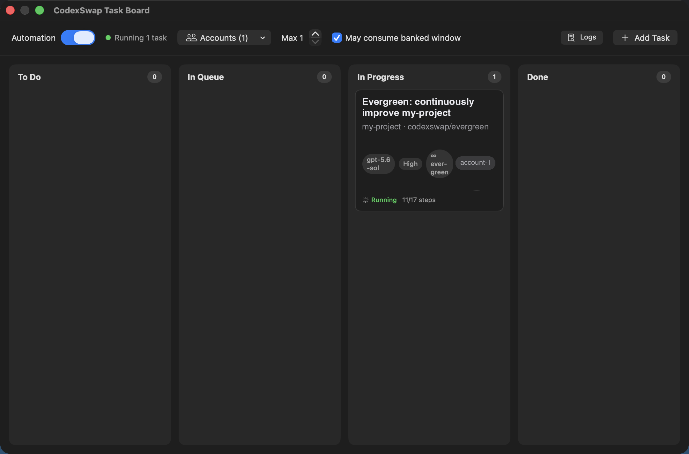
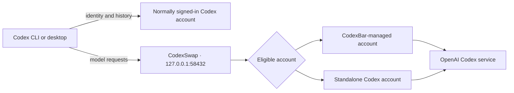

<p align="center">
  
</p>

<h1 align="center">CodexSwap</h1>

<p align="center">
  <strong>Keep Codex moving when one account runs out of room.</strong>
</p>

<p align="center">
  A native macOS menu-bar app that routes your Codex work across eligible accounts,<br>
  watches quota, preserves active turns, and runs queued tasks when capacity returns.
</p>

<p align="center">
  <a href="https://github.com/M1Vj/CodexSwap/actions/workflows/ci.yml"></a>
  <a href="https://www.apple.com/macos/"></a>
  <a href="https://www.swift.org/"></a>
  <a href="LICENSE"></a>
  
</p>

<p align="center">
  <a href="#quick-start"><strong>Quick start</strong></a> ·
  <a href="#how-routing-works">How it works</a> ·
  <a href="#task-board">Task Board</a> ·
  <a href="docs/TROUBLESHOOTING.md">Troubleshooting</a>
</p>



> [!NOTE]
> CodexSwap is in early access. The app works from source today; signed and notarized release downloads and the Homebrew cask will become available with the first public release.

## Why CodexSwap?

Codex can keep a productive session alive long after one account reaches a usage limit. Replacing authentication files is not a reliable fix because a running Codex process keeps authentication in memory.

CodexSwap solves the problem at the routing layer:

- **New work gets an eligible account.** Choose priority order or round-robin selection.
- **Active work stays coherent.** Interactive turns and automated runs remain pinned to the account that started them.
- **Quota becomes visible.** See five-hour and weekly windows, reset countdowns, routing state, and account health from the menu bar.
- **Backlog can wait for capacity.** Queue repository tasks and let CodexSwap start them when quota returns.
- **Your Codex identity stays intact.** Model traffic is routed locally while normal Codex identity and history traffic stays with the account signed in to Codex.

**Your accounts. Your Mac. No CodexSwap cloud. No analytics.**

## What you get

| | Capability | What it means in practice |
| --- | --- | --- |
| 🔁 | **Quota-aware routing** | Select an eligible account for each new turn or run without replacing auth files mid-session. |
| 📌 | **Sticky active work** | Usage polling and idle time never move an active turn or Task Board run. |
| 📊 | **Quota cockpit** | Monitor account usage, reset times, routing pauses, and sign-in state from a native menu-bar app. |
| 🧭 | **Clear exhaustion policies** | Choose Reset Current First, Switch First, or Stop & Notify separately for interactive work and automation. |
| 🗂️ | **Automated Task Board** | Queue plan-first `codex exec` work for the next available quota window. |
| ♾️ | **Evergreen tasks** | Run bounded improvement cycles continuously, with archived plans and resumable handoffs. |
| 🛡️ | **Local safety boundaries** | Loopback-only proxy, reversible Codex configuration, no telemetry, and no approval bypass for task runs. |
| 🔌 | **Flexible onboarding** | Import CodexBar-managed accounts or use standalone accounts created through `codex login`. |

## Quick start

### Build from source today

Requirements: macOS 14 or newer, Git, and Xcode Command Line Tools with a Swift 6-compatible toolchain.

```bash
git clone https://github.com/M1Vj/CodexSwap.git
cd CodexSwap
swift test
Scripts/build-universal.sh
open dist/CodexSwap.app
```

The source build is ad-hoc signed locally. `build-universal.sh` produces a universal Apple silicon and Intel app; the public release adds Developer ID signing, notarization, stapling, and Gatekeeper verification.

### Set up routing

1. Open CodexSwap. It appears in the macOS menu bar, not the Dock.
2. Open **Settings…** (`⌘,`).
3. In **Accounts**, choose **Add in CodexBar…**. If you do not use CodexBar, choose **Add Standalone…** and complete the standard `codex login` flow.
4. Choose **Rescan Accounts** if the new account does not appear immediately.
5. In **General**, enable **Route Codex through CodexSwap**.
6. Restart existing Codex CLI or desktop sessions once so they load the new route.

That is the only required setup. **Launch CodexSwap at Login** is a separate option and is never enabled behind your back.

> [!IMPORTANT]
> Routed Codex clients need the CodexSwap background app running. If CodexSwap is not listening on `127.0.0.1:58432`, reopen it from `/Applications`. Before intentionally quitting or uninstalling CodexSwap, disable routing so your previous Codex provider configuration is restored.

### Signed releases and Homebrew

Once the first Developer ID-signed and Apple-notarized release is published:

```bash
brew tap M1Vj/CodexSwap https://github.com/M1Vj/CodexSwap
brew install --cask codexswap
```

Release archives will appear on [GitHub Releases](https://github.com/M1Vj/CodexSwap/releases) only after signing, notarization, ticket stapling, checksum verification, and Gatekeeper assessment pass. CodexSwap intentionally does not present an ad-hoc build as a trusted public release.

## How routing works

CodexSwap keeps Codex's built-in `openai` provider identity. It changes only `openai_base_url` for model requests, then replaces the authorization header locally with the selected account's current credential.


```mermaid
flowchart LR
    C["Codex CLI or desktop"] -->|"identity and history"| H["Normally signed-in Codex account"]
    C -->|"model requests"| P["CodexSwap · 127.0.0.1:58432"]
    P --> R{"Eligible account"}
    R --> B["CodexBar-managed account"]
    R --> S["Standalone Codex account"]
    B --> O["OpenAI Codex service"]
    S --> O
```

This design has three important consequences:

1. **History is not replaced or migrated.** Login and history remain tied to the account signed in to Codex.
2. **A live turn is sticky.** Priority and round-robin selection apply when new work begins, not during every request.
3. **Routing is reversible.** CodexSwap backs up displaced configuration and restores it when routing is disabled. If another tool changes the managed block, CodexSwap asks before repairing it.

Earlier CodexSwap builds used a separate provider identity that could hide existing history. They did not delete it. Current builds migrate that configuration to the built-in-provider route automatically; restart Codex once after migration.

## Task Board

Open **Task Board…** (`⌘T`) to turn spare quota into completed repository work.

Each card can define:

- a prompt, repository, and working branch;
- a primary model and fallback chain;
- reasoning effort and sandbox network access;
- the accounts allowed to serve that task;
- a one-shot job or an evergreen sequence of bounded cycles.

Queued work starts as a sandboxed background `codex exec` session when an allowed account has enough headroom. Every task plans first in `.codexswap/tasks/<slug>/PLAN.md`, records chronological work in `WORKLOG.md`, and reaches **Done** only after the process exits successfully with its checklist complete.

The inspector exposes the evidence instead of hiding it: live logs, run duration and outcome, token usage, accounts used, parsed checklist progress, commits, diff totals, and unexpected-branch warnings. Waiting cards explain whether they are blocked by quota, backoff, a busy repository, or concurrency.

Task runs use Codex's workspace-write sandbox and never bypass approvals. Repository paths are serialized so two runs cannot race in the same working tree. Transient failures use bounded backoff, rejected models follow the configured fallback chain, and stalled streams are stopped and retried instead of occupying a slot forever.

## Routing and reset rules

CodexSwap is intentionally conservative about account changes:

- A new interactive turn or Task Board run selects by priority or round-robin.
- The selected account stays pinned for the active turn or process lifetime.
- Displayed usage percentage, polling, and idle time never trigger a switch.
- A semantic upstream `usage_limit_reached` response may invoke the configured policy once, with at most one retry.
- **Disable Routing** pauses one account without deleting credentials, history, or saved Task Board choices.
- Automatic reset-credit use is off by default and skips protected or paused accounts.
- Manual **Use Reset…** always asks for confirmation and selects the earliest-expiring usable credit.

Reset-credit access uses an undocumented internal endpoint and may change without notice. Ordinary account routing does not depend on that endpoint.

### Quota warm-up

Usage polling does not start a quota window. Optional warm-up sends one small, real Codex request to an eligible account, refreshes usage afterward, and reports only reset data returned by the service.

Warm-up consumes quota, cannot guarantee how OpenAI will represent every window, and is disabled by default. **Warm all accounts now…** offers the same operation with confirmation.

## Privacy and security

CodexSwap handles authentication tokens, so its trust boundary is intentionally small and visible.

| Guarantee | Behavior |
| --- | --- |
| **Local proxy only** | Listens on IPv4 loopback; no LAN listener. |
| **No CodexSwap cloud** | Model requests go to OpenAI; account data is not sent to the maintainer. |
| **No analytics** | No usage telemetry or tracking service. |
| **Restricted local data** | Settings and imported state live under `~/Library/Application Support/CodexSwap/` with user-only permissions where supported. |
| **Credential ownership** | CodexBar keeps ownership of CodexBar-managed accounts; standalone accounts come from standard Codex login files. |
| **Recoverable configuration** | Routing changes are backed up and restored rather than silently replacing unrelated configuration. |

Never attach auth files, tokens, account IDs, or verbose request headers to a public issue. Read the complete [Privacy policy](PRIVACY.md) and [Security policy](SECURITY.md). Report vulnerabilities through [GitHub private vulnerability reporting](https://github.com/M1Vj/CodexSwap/security/advisories/new).

## FAQ

<details>
<summary><strong>Does CodexSwap delete or move Codex history?</strong></summary>

No. Current routing changes only the model endpoint. Identity and history traffic stays with the account signed in to Codex. Earlier provider-based routing could make existing history appear hidden; it did not delete it.
</details>

<details>
<summary><strong>Does it switch accounts in the middle of every request?</strong></summary>

No. A new turn or run selects an account, then stays pinned. Only an actual upstream usage-limit response—or an explicit administrative pause—can change the route for ongoing work.
</details>

<details>
<summary><strong>Do I need CodexBar?</strong></summary>

No. CodexBar is the easiest onboarding path for accounts it already manages. Standalone accounts created with the normal `codex login` flow are also supported.
</details>

<details>
<summary><strong>Does CodexSwap bypass OpenAI limits?</strong></summary>

No. It observes the limits and reset information returned for accounts you control. It routes only to an eligible account, and optional warm-up or reset-credit actions are explicit about quota consumption.
</details>

<details>
<summary><strong>What happens if CodexSwap quits while routing is enabled?</strong></summary>

Routed model requests cannot reach the local proxy until CodexSwap is reopened. Open the app again, or disable routing before intentionally quitting so the previous provider configuration is restored. Enabling **Launch CodexSwap at Login** prevents this after a Mac restart.
</details>

<details>
<summary><strong>Does it support Apple silicon and Intel Macs?</strong></summary>

Yes. Both `build-universal.sh` and the public release pipeline build a universal app containing Apple silicon and Intel binaries.
</details>

## Uninstall

First disable **Route Codex through CodexSwap** so the prior Codex provider configuration is restored.

For Homebrew installations:

```bash
brew uninstall --cask --zap codexswap
brew untap M1Vj/CodexSwap
```

For manual installations, quit CodexSwap and move the app from `/Applications` to Trash. Removing `~/Library/Application Support/CodexSwap/` deletes CodexSwap's imported state and settings; it does not delete `~/.codex`, CodexBar-managed homes, Codex history, or OpenAI sessions.

## Development

```bash
swift package resolve
swift test
swift build -c release
Scripts/build-app.sh
```

The codebase is split into:

- `Sources/SwapKit` — routing, account state, quota, reset, warm-up, automation, and proxy logic.
- `Sources/CodexSwapApp` — native menu-bar, Settings, and Task Board interfaces.
- `Sources/swapd` — headless development and diagnostic commands.
- `Scripts` — reproducible build, universal packaging, signing, notarization, verification, and cask tooling.

Start with [Contributing](CONTRIBUTING.md), [Troubleshooting](docs/TROUBLESHOOTING.md), and the [release process](docs/RELEASING.md). Releases follow [Semantic Versioning](https://semver.org/) and are recorded in the [Changelog](CHANGELOG.md).

## Contributing

Bug reports, focused pull requests, documentation improvements, and reproducible feature proposals are welcome. Security issues belong in private vulnerability reporting, never a public issue.

If CodexSwap keeps your workflow moving, consider starring the repository—it helps other Codex power users find it.

## Project status

CodexSwap is an independent open-source project and is not affiliated with or endorsed by OpenAI. Codex, ChatGPT, and OpenAI are trademarks of OpenAI.

## License

[MIT](LICENSE) © CodexSwap contributors.
